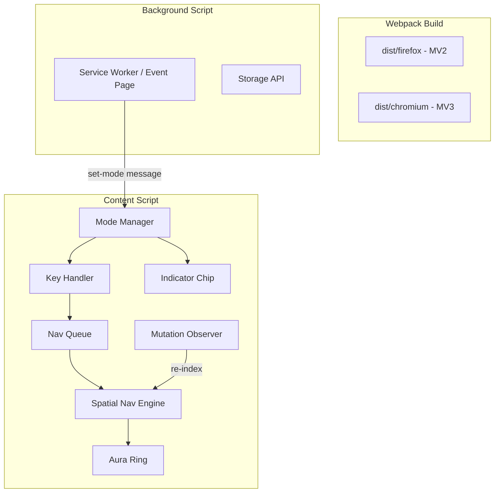

# Navigator

A browser extension that brings vim-style modal navigation to any web page. Navigate focusable elements with `h/j/k/l` keys using directional spatial search, highlighted by a smooth animated aura ring.

## Features

- **Three modes**: Normal (invisible), Navigation (all focusable elements), Editing (only input fields)
- **Cone-based spatial navigation**: Smart directional search finds the most intuitive next element, no matter the page layout
- **Animated aura ring**: A glowing outline that morphs between elements, matching their shape and border-radius
- **Mode indicator chip**: A minimal animated indicator at the bottom of the viewport shows your current mode
- **Configurable everything**: Keybindings, animation speed, cone angle, glow intensity
- **Cross-browser**: Works on Chrome, Edge, Brave, Firefox, and other Chromium-based browsers
- **Lightweight**: ~14KB content script, no external runtime dependencies

## Installation

### From Source (Developer)

Prerequisites: Node.js 18+, npm

```bash
git clone "https://github.com/Adam-Yung/Navigator.git"
cd navigator
npm install
npm run build
```

**Chrome/Edge/Brave:**
1. Open `chrome://extensions` (or `edge://extensions`, `brave://extensions`)
2. Enable "Developer mode"
3. Click "Load unpacked"
4. Select the `dist/chromium` folder

**Firefox:**
1. Open `about:debugging#/runtime/this-firefox`
2. Click "Load Temporary Add-on"
3. Select any file inside the `dist/firefox` folder

### Development

```bash
npm run dev       # Watch mode — rebuilds on file changes
npm run build     # Production build for both browsers
npm run build:dev # Development build with source maps
```

## Usage

### Modes

| Mode | Activation | Behavior |
|------|-----------|----------|
| Normal | `Escape` | Extension is invisible. Browser behaves normally. |
| Navigation | `Ctrl+Alt+N` | All focusable elements navigable via h/j/k/l. |
| Editing | `Ctrl+Alt+E` | Only editable fields (inputs, textareas) navigable. |

### Navigation Keys (in Navigation/Editing mode)

| Key | Action |
|-----|--------|
| `h` | Move focus left |
| `j` | Move focus down |
| `k` | Move focus up |
| `l` | Move focus right |
| `Enter` | Activate focused element (click link, focus input, etc.) |
| `Ctrl+Enter` / `Cmd+Enter` | Open focused link in new tab |
| `Escape` | Return to Normal mode |

### How Navigation Works

From the currently focused element, pressing a direction key casts a 90-degree cone in that direction. All elements whose centers fall within the cone are scored by distance and angular alignment. The best-scoring element receives focus.

If no element exists within the cone, the search automatically widens (up to 180 degrees) to find the nearest element in that general direction.

This approach works on any layout — grids, sidebars, masonry, flex-wrap, absolute positioning — and guarantees every element is reachable.

### Visual Indicators

**Aura Ring**: A glowing outline around the focused element. Blue-violet in Navigation mode, amber-gold in Editing mode. Smoothly animates between elements.

**Mode Chip**: A minimal indicator at the bottom center of the viewport. Appears as a dot (persistent color reference), briefly expands to show the mode name on mode change, then contracts back to a dot.

## Configuration

Open the extension options page (right-click extension icon → Options) to configure:

**Keybindings** — Click any keybinding field, press your desired key combination, and it's recorded instantly.

**Appearance**
- Animation duration: 0ms (instant) to 500ms (slow and smooth)
- Aura intensity: Subtle, Normal, or Vibrant glow

**Behavior**
- Auto-scroll: Automatically scroll off-screen elements into view when focused
- Cone angle: 60° (narrow/precise) to 120° (wide/forgiving)

## Architecture



**Content Script** (`content.js`, ~14KB): Injected into every page. Contains the mode state machine, spatial navigation engine, key event handler, visual renderers (aura ring + indicator chip), and DOM mutation observer. All visual elements live in Shadow DOM to prevent style conflicts.

**Background Script** (`background.js`, ~1.2KB): Handles global keyboard shortcut commands and sends mode-switch messages to the active tab. Sets default settings on install.

**Options Page** (`options.js` + `options.css`): Dark-themed settings UI with live preview of the aura ring animation and a keybinding recorder.

## Project Structure

```
src/
├── content/
│   ├── index.ts              Entry point, wires all modules together
│   ├── mode-manager.ts       Mode state machine (Normal/Navigation/Editing)
│   ├── spatial-nav.ts        Cone-based directional element search
│   ├── aura-ring.ts          Animated focus ring renderer (Shadow DOM)
│   ├── nav-queue.ts          Rapid keypress queue → single animation
│   ├── key-handler.ts        Keydown capture and dispatch
│   ├── mutation-observer.ts  DOM/scroll/resize watch for re-indexing
│   └── indicator.ts          Mode chip with dot/pill animation
├── background/
│   └── index.ts              Command handler + settings init
├── options/
│   ├── options.html          Settings page markup
│   ├── options.css           Dark-themed styles
│   └── options.ts            Keybinding recorder, controls, live preview
└── shared/
    ├── types.ts              TypeScript interfaces
    ├── constants.ts          Default settings, selectors, colors
    └── storage.ts            Cross-browser storage abstraction
```

## Browser Support

| Browser | Manifest | Minimum Version |
|---------|----------|-----------------|
| Chrome | V3 | 88+ |
| Edge | V3 | 88+ |
| Brave | V3 | 88+ |
| Opera | V3 | 74+ |
| Firefox | V2 | 109+ |

## License

MIT
