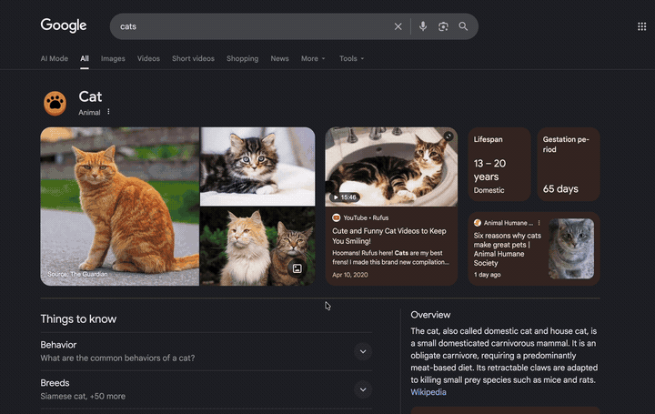
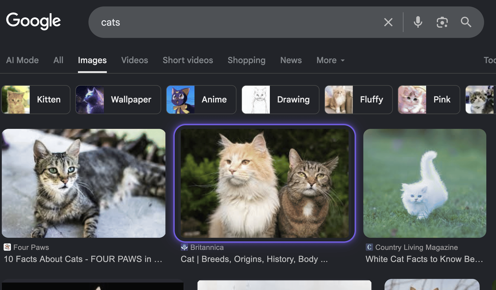

# Navigator

Navigate any web page with your keyboard. Alt-layer navigation with a glowing animated focus ring.

<p align="center">
  
</p>

## Why Navigator?

Keyboard-first browsing shouldn't mean fighting tab order or hunting for links. Navigator gives you an **Alt-layer** — hold Alt and press a key to scroll, pick elements, search text, or read content. Three focused modes replace every mouse interaction:

- **Picker** — divide-and-conquer element selection with zone hints
- **Search** — fuzzy-find anything visible on the page
- **Caret** — vim-style cursor for reading and copying text

**Zero dependencies. ~14 KB. Runs on every page.**

## Quick Start

```bash
git clone "https://github.com/Adam-Yung/Navigator.git"
cd Navigator && npm install && npm run build
```

Then load `dist/chromium` as an unpacked extension (Chrome/Edge/Brave) or `dist/firefox` as a temporary add-on (Firefox).

## Keybindings

### Alt-Layer Shortcuts

| Combo | Action |
|-------|--------|
| `Alt+F` | Element Picker |
| `Alt+/` | Text Search |
| `Alt+V` | Caret / Visual mode |
| `Alt+T` | Tab Picker |
| `Alt+Space` | Quick Actions palette |
| `Alt+J` / `K` | Scroll down / up |
| `Alt+H` / `L` | Scroll left / right |
| `Alt+Shift+J` / `K` | Fast scroll |
| `Alt+[` / `]` | History back / forward |
| `Alt+Shift+[` / `]` | Section prev / next |
| `Alt+U` | URL up one segment |
| `Alt+G` | Focus first input |
| `Alt+O` / `I` | Focus history back / forward |
| `Alt+Y` | Yank mode |
| `Alt+M` | Set mark |
| `Alt+'` | Jump to mark |
| `Alt+.` | Repeat last action |
| `Alt+?` | Show cheatsheet |
| `Alt+1-9` | Quick-pick top elements |
| `Ctrl+Alt+A` | Toggle extension on / off |

### Picker Mode (`Alt+F`)

1. Screen divides into a **3×2 grid** — zones `A` `S` `D` `F` `G` `H`
2. Press a zone key → that zone spotlights (rest of page dims/blurs)
3. Hint labels appear on interactive elements within the zone
4. Type label characters to narrow and select
5. Numbers `1-9` directly select top elements by priority
6. `Shift+letter` multi-selects, `Enter` batch-activates
7. `Shift+Enter` opens links in a new tab

Modal-aware: if a dialog or popover is already open, the zone phase is skipped and hints appear directly inside it.

### Search Mode (`Alt+/`)

- Fuzzy-matches visible text on interactive elements
- Scope filters: `@link:`, `@btn:`, `@input:` prefixes
- `Alt+R` toggles regex mode
- `Tab` / arrows cycle through matches
- `Enter` activates the selected match

### Caret Mode (`Alt+V`)

| Key | Action |
|-----|--------|
| `h` `j` `k` `l` | Character / line movement |
| `w` / `b` | Word forward / back |
| `0` / `$` | Line start / end |
| `gg` / `G` | Top / bottom of page |
| `[count]` prefix | Repeat motion |
| `v` | Toggle visual selection |
| `y` | Yank selection to clipboard |
| `/` | Search-to-jump |
| `n` / `N` | Next / previous match |
| `q` or `Esc` | Exit caret mode |

Traverses Shadow DOM boundaries for full coverage.

## How It Works

Navigator runs as a lightweight content script injected into every page. When you press an Alt-layer shortcut, a **mode arbiter** routes the key to the correct handler — picker, search, caret, or scroll engine — ensuring only one mode is active at a time.

The **Aura Ring** — a glowing purple border — wraps the currently targeted element. It animates smoothly between targets, breathes subtly when idle, leaves a ghost trail on departure, and adapts its border-radius to the element shape. Intensity is configurable: *subtle*, *normal*, or *vibrant*.

Hold `Alt` for 200 ms to reveal a helper bar showing all shortcuts plus numbered badges on top-priority elements.

<p align="center">
  
</p>

## Configuration

Right-click the extension icon and select **Options** to configure:

- **Keybindings** — fully remappable; click a field and press your desired combo
- **Aura intensity** — Subtle, Normal, or Vibrant glow
- **Scroll behavior** — momentum scrolling with focus-first target resolution
- **Disabled sites** — URL patterns where Navigator won't activate

## Browser Support

| Browser | Minimum Version |
|---------|-----------------|
| Chrome / Edge / Brave | 88+ |
| Firefox | 140+ |

## Development

```bash
npm run dev        # Watch mode with rebuilds
npm run build      # Production build (chromium + firefox)
npm run test       # Unit tests
npm run lint       # Linter
```

## Architecture

```
Content Script (~14 KB)         Background              Options Page
├── Mode Arbiter                ├── Command Router       ├── Keybinding Recorder
├── Key Router (Alt-layer)      └── Storage Init         ├── Live Preview
├── Picker Engine                                        └── Settings UI
│   ├── Zone Grid (3×2)
│   ├── Hint Renderer
│   └── Multi-Select Handler
├── Search Engine
│   ├── Fuzzy Matcher
│   └── Scope Filters
├── Caret Engine
│   ├── Cursor + Selection
│   └── Shadow DOM Walker
├── Scroll Engine (momentum)
├── Aura Ring (Shadow DOM)
├── Alt-Hold Helper
├── Quick Actions Palette
├── Tab Picker
├── Marks & Focus History
└── Mutation Observer
```

All visual elements are rendered in isolated Shadow DOM — no CSS conflicts with host pages.

## License

MIT
