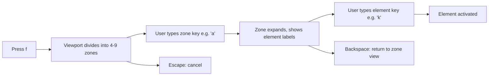
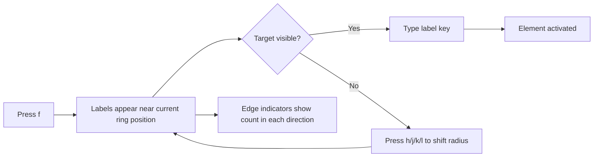
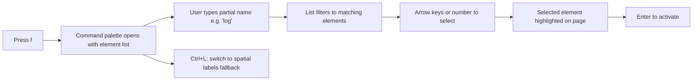
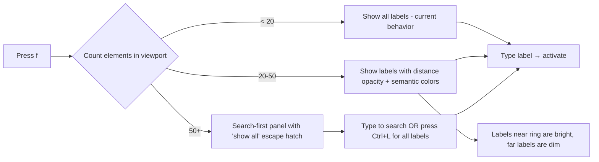
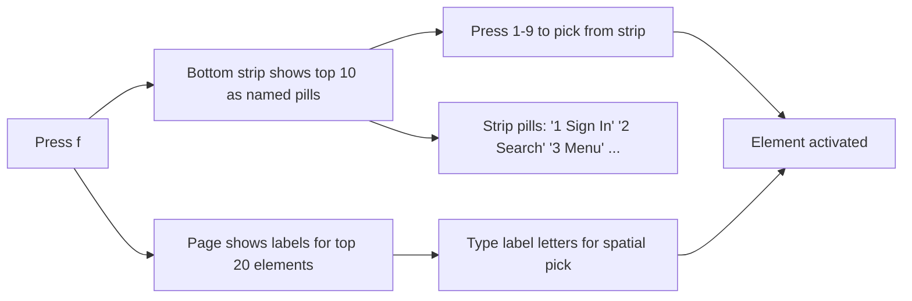
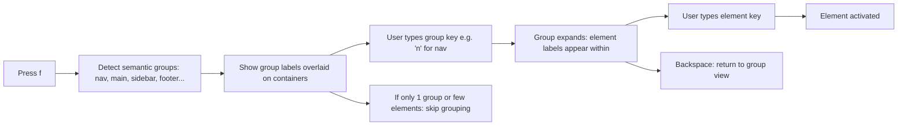

# Picker Mode Design Analysis Report

> **Project:** Navigator — Keyboard-driven web navigation extension  
> **Author:** Design Analysis  
> **Date:** August 2026  
> **Status:** Proposal / Comparison  

---

## Executive Summary

Navigator's picker mode (activated via `f` in navigation mode) overlays letter labels on all interactive elements, allowing users to type a label to jump to or activate that element. This is powerful but creates visual clutter on dense pages — a news feed with 100+ links becomes a wall of labels that defeats the purpose of quick navigation.

This report evaluates six alternative approaches to redesigning picker mode for reduced clutter and increased intuition. Each approach is analyzed for UX trade-offs, implementation complexity, and suitability across different page types. The final recommendation proposes a phased implementation path combining the strongest aspects of multiple approaches.

### Current State

The existing picker implementation (`src/content/hint-mode.ts`) supports:

- Full alphabet hint characters (`asdfghjklqwertyuiopzxcvbnm`)
- Multi-character labels for 26+ elements (up to depth 5)
- Overlap resolution via vertical displacement
- Distance-based staggered entry animations
- Modal scoping (dialogs, popovers, aria-modal)
- Multi-select with Shift+letter
- Quick-pick via Alt+1-9 (by element prominence)
- Numeric shortcuts for first 10 results


### Design Principles

Any redesign must preserve:

1. **Keyboard-first** — zero mouse interaction required
2. **Speed** — target element reachable in ≤3 keystrokes for common cases
3. **Zero-dependency visual isolation** — Shadow DOM, no host CSS conflicts
4. **Dark UI with purple accent** — consistent with aura ring (`hsla(250, 80%, 65%)`)
5. **Vim-inspired mental model** — composable, modal, predictable

---


## Approach 1: Zone-Based / Sector Picking


### Description

Divide the viewport into a grid of labeled zones (4–9 sectors). The user first picks a zone, then elements within that zone receive individual labels. This creates a two-phase interaction that dramatically reduces the number of simultaneously visible labels.

### User Flow




### Design Details

**Zone Layout Options:**

- **2×2 grid** (4 zones): Minimum cognitive load, max ~25 elements per zone
- **3×3 grid** (9 zones): Finer targeting, each zone has ~11 elements on a 100-element page
- **Adaptive**: 2×2 for <40 elements, 3×3 for 40+

**Visual Treatment:**

- Semi-transparent zone overlays with large centered letter (e.g., `A`, `S`, `D`, `F` for 2×2)
- Zone borders rendered as subtle dashed lines with purple accent
- Active zone highlighted with glow; inactive zones fade out on selection


### Pros

- Dramatically reduced cognitive load at each step (max 9 choices → max ~25 choices)
- Still achievable in 2 keystrokes for most pages
- Spatially intuitive — zones map to physical screen regions
- Works consistently regardless of page density


### Cons

- Requires users to learn zone positions (though positions are stable)
- Less direct than single-label picking for sparse pages
- Zone boundaries may split logically related elements (nav bar across two zones)
- Extra keystroke compared to current approach on sparse pages


### UX Trade-offs


| Factor              | Rating                                        |
| ------------------- | --------------------------------------------- |
| Learning curve      | Medium — zone positions become muscle memory  |
| Speed (sparse page) | Slower — 2 keystrokes vs. 1                   |
| Speed (dense page)  | Faster — cognitive load reduction compensates |
| Visual clarity      | Excellent — max 9 labels visible initially    |
| Spatial context     | Preserved — zones map to screen regions       |


### Implementation Complexity: Medium

- New state: `zone-select` → `element-select` within picker mode
- Zone overlay component (grid divider with labels)
- Element filtering by bounding rect intersection with zone rect
- Backspace to return to zone view
- ~150 lines new code, minimal changes to existing `hint-mode.ts`


### Page Type Suitability


| Page Type         | Fitness                                               |
| ----------------- | ----------------------------------------------------- |
| Simple blog       | Overkill — few elements don't need zones              |
| Dense dashboard   | Excellent — natural grid aligns with dashboard panels |
| Social feed       | Good — vertical zones capture feed sections           |
| SPA (Gmail, etc.) | Good — sidebar/main/header map to zones naturally     |


---


## Approach 2: Aura Ring Proximity Model


### Description

Only show labels for elements near the current focus ring position. The visible radius forms a "spotlight" around the cursor. Users can shift the visible region directionally with `h/j/k/l` without activating any element. Elements outside the radius are represented as edge indicators (e.g., "3 more →").

### User Flow




### Design Details

**Visibility Radius:**

- Default: 300px from ring center (captures ~5-15 elements typically)
- Elements within radius get full labels
- Elements 300-500px away get dimmed dots (presence indicators)
- Beyond 500px: counted in edge indicators

**Edge Indicators:**

- Small pills at viewport edges: `← 5` / `12 ↓` / `→ 3` / `↑ 0`
- Update dynamically as radius shifts
- Styled as subtle floating badges (match `multi-badge` aesthetic)

**Radius Shifting:**

- `h/j/k/l` moves the center point by 200px in that direction
- Labels animate in/out as they enter/leave the radius
- Smooth transition (80ms) maintains spatial continuity


### Pros

- Minimal visual clutter at any given moment (5-15 labels max)
- Preserves spatial context — user always knows "where" they are on the page
- Natural extension of existing aura ring concept
- Feels like exploring with a flashlight — intuitive metaphor


### Cons

- Requires extra steps if target is far from current position
- "Jump across page" is significantly slower (multiple shifts needed)
- Users must track their position mentally during shifts
- Edge indicators add minor but constant UI noise


### UX Trade-offs


| Factor                  | Rating                                           |
| ----------------------- | ------------------------------------------------ |
| Learning curve          | Low — spatial shifting is intuitive              |
| Speed (sparse page)     | Good — all elements likely within initial radius |
| Speed (dense page)      | Medium — may need 1-2 shifts                     |
| Speed (cross-page jump) | Poor — multiple shifts needed                    |
| Visual clarity          | Excellent — never more than ~15 labels           |
| Spatial context         | Excellent — continuous, not discrete             |


### Implementation Complexity: Medium-High

- Dynamic visibility radius calculation (distance from center point)
- Directional shifting logic with boundary clamping
- Edge indicator component (4 positioned badges)
- Smooth label enter/exit animations based on radius intersection
- Center point state management separate from ring position
- ~250 lines new code, moderate refactor of `activatePicker()`


### Page Type Suitability


| Page Type         | Fitness                                              |
| ----------------- | ---------------------------------------------------- |
| Simple blog       | Good — everything likely in one radius               |
| Dense dashboard   | Decent — but many shifts needed for distant panels   |
| Social feed       | Excellent — natural vertical scrolling through items |
| SPA (Gmail, etc.) | Poor — jumping from sidebar to main content is slow  |


---


## Approach 3: Command Palette / Search-First Model


### Description

On `f`, show a text-searchable panel (similar to VS Code's `Ctrl+P` or the existing quick-actions panel) instead of page overlays. Elements are listed by their accessible name with fuzzy matching. The selected element gets a highlight ring on the page for spatial confirmation.

### User Flow




### Design Details

**Panel Design:**

- Reuses existing `quick-actions` panel architecture (already built)
- Position: top 20% of viewport, centered, 420px wide
- Each row shows: number badge + element name + element type tag + URL preview (for links)

**Element Naming:**

- Priority: `aria-label` → visible text content → `title` → `placeholder` → tag+class
- Links show URL domain as secondary text
- Buttons show text content
- Inputs show label or placeholder

**Page Highlight:**

- As user arrows through results, selected element gets a temporary aura ring
- Highlight provides spatial confirmation without cluttering the page
- Auto-scrolls to reveal off-screen selected elements


### Pros

- Zero page clutter — all UI contained in a single panel
- Works identically on simple and extremely complex pages
- Familiar UX pattern (VS Code, Spotlight, Alfred)
- Fuzzy matching handles typos and partial recall
- Accessible — works perfectly with screen readers


### Cons

- Requires knowing element names (or at least partial text)
- Loses spatial context — users can't "see" the page layout
- Not as fast for visual targets (user sees a button, has to recall its text)
- Dense pages with similar names (10 "Read more" links) create ambiguous results


### UX Trade-offs


| Factor                | Rating                                     |
| --------------------- | ------------------------------------------ |
| Learning curve        | Very low — universal pattern               |
| Speed (known target)  | Excellent — type 2-3 chars, enter          |
| Speed (visual target) | Poor — requires recalling text             |
| Visual clarity        | Perfect — zero page overlays               |
| Spatial context       | Poor — text list, no spatial mapping       |
| Accessibility         | Excellent — fully screen-reader compatible |


### Implementation Complexity: Low-Medium

- Panel component already exists (`quick-actions.ts`)
- Need: element scanning → name extraction → list rendering
- Fuzzy matching already implemented (`fuzzyMatch()`)
- Highlight ring on selection (reuse `transitionTo()`)
- ~120 lines new code, mostly wiring existing infrastructure


### Page Type Suitability


| Page Type         | Fitness                                                     |
| ----------------- | ----------------------------------------------------------- |
| Simple blog       | Good — links have descriptive text                          |
| Dense dashboard   | Excellent — most elements have distinct labels              |
| Social feed       | Poor — many elements share names ("Like", "Share", "Reply") |
| SPA (Gmail, etc.) | Good — buttons/actions have unique labels                   |


---


## Approach 4: Smart Density Adaptation (Current + Refinements)


### Description

Keep the current overlay approach but automatically adapt behavior based on page density. The system detects how many interactive elements are in the viewport and applies progressive disclosure — showing all labels on sparse pages, applying visual hierarchy on medium pages, and switching to search-first on very dense pages.

### User Flow




### Design Details

**Tier 1 (<20 elements):** Current behavior, unchanged.

**Tier 2 (20-50 elements):**

- Distance-based opacity: labels near viewport center are fully opaque, edges fade to 40%
- Semantic coloring: links get blue-tinted labels, buttons get purple, inputs get green
- Cap visible labels at 30; remaining get presence dots
- Top 10 still get numeric badges

**Tier 3 (50+ elements):**

- Opens search-first panel (Approach 3) by default
- Shows count: "127 elements — type to search"
- Escape hatch: `Ctrl+L` force-shows all labels (with density tier 2 treatment)
- Panel shows top 10 by prominence as quick picks

**Thresholds are configurable** in settings (for users who prefer always-labels or always-search).

### Pros

- Best of all worlds — progressive disclosure
- Familiar for current users on sparse pages (no behavior change)
- Graceful degradation on dense pages
- Configurable thresholds respect user preference
- Minimal new UI components needed


### Cons

- Behavior changes between pages may confuse users
- Harder to build consistent muscle memory (different modes on different pages)
- Threshold boundaries feel arbitrary ("why did it switch?")
- More conditional logic = more edge cases to test


### UX Trade-offs


| Factor               | Rating                                              |
| -------------------- | --------------------------------------------------- |
| Learning curve       | Low for sparse pages, medium for the mode-switching |
| Speed (sparse page)  | Excellent — identical to current                    |
| Speed (dense page)   | Good — search is fast for known targets             |
| Consistency          | Poor — different pages behave differently           |
| Visual clarity       | Good-to-excellent depending on tier                 |
| Configuration burden | Medium — users may need to tune thresholds          |


### Implementation Complexity: Low

- Element count is already computed in `activatePicker()`
- Tier 1: no changes
- Tier 2: add CSS opacity variable based on distance (similar to existing entry animation)
- Tier 3: conditional branch to invoke search panel
- Threshold settings: add to `Settings` type + options page
- ~80 lines new code, mostly threshold logic


### Page Type Suitability


| Page Type         | Fitness                                          |
| ----------------- | ------------------------------------------------ |
| Simple blog       | Excellent — Tier 1, unchanged                    |
| Dense dashboard   | Good — Tier 2/3 adapts appropriately             |
| Social feed       | Good — Tier 3 search handles repetitive elements |
| SPA (Gmail, etc.) | Good — adapts per view within the SPA            |


---


## Approach 5: Hybrid Quick-Pick Strip + Spatial Overlay


### Description

A bottom strip shows the top 5-10 most prominent elements as named pills (similar to a tab picker or command bar suggestions). The page still shows spatial labels, but capped at the top 20 closest/largest elements. Users choose: type a letter from the page for spatial targeting, OR pick from the strip by number for quick access to prominent elements.

### User Flow




### Design Details

**Bottom Strip:**

- Fixed position bar, 48px height, full width
- Shows top 5-10 elements by prominence score (area × visibility × landmark weight)
- Each pill: number badge + truncated element name (max 12 chars)
- Styled as dark glassmorphic bar matching hint modal aesthetic
- Scrollable horizontally if >10 items

**Spatial Labels (Capped):**

- Only top 20 elements by proximity to viewport center get letter labels
- Remaining elements shown as subtle dots (presence markers)
- Labels use the existing hint-label styling
- Number badges (1-9) on labels that also appear in the strip

**Dual Input:**

- Numbers 1-9: instant pick from strip (no Enter needed)
- Letters a-z: filter spatial labels (existing behavior)
- The two pathways coexist without conflict


### Pros

- Dual pathways accommodate different mental models (spatial vs. textual)
- Never overwhelming — max 20 labels + 10 pills
- Strip provides named access (easier recall than random labels)
- Graceful for dense pages (strip catches the most important elements)
- Number shortcuts work identically to existing Alt+1-9 quick-pick


### Cons

- More UI elements on screen (strip + labels + modal)
- Two mental models to learn ("do I type a letter or a number?")
- Strip takes up 48px of viewport space
- Prominence scoring may not match user intent


### UX Trade-offs


| Factor                        | Rating                                        |
| ----------------------------- | --------------------------------------------- |
| Learning curve                | Medium — two systems to understand            |
| Speed (known target in strip) | Excellent — single digit press                |
| Speed (spatial target)        | Good — capped labels are manageable           |
| Visual clarity                | Good — but more total UI elements             |
| Discoverability               | Excellent — strip labels are self-documenting |
| Screen real estate            | Costs 48px bottom bar                         |


### Implementation Complexity: Medium

- New strip component (~100 lines, Shadow DOM)
- Prominence scoring (partially exists in `activateQuickPick`)
- Label capping logic (sort by distance, slice top 20)
- Dual input routing (numbers → strip, letters → labels)
- ~200 lines new code, moderate integration work


### Page Type Suitability


| Page Type         | Fitness                                                         |
| ----------------- | --------------------------------------------------------------- |
| Simple blog       | Good — strip has the key links, labels handle the rest          |
| Dense dashboard   | Excellent — strip catches primary actions, labels for secondary |
| Social feed       | Good — strip surfaces key actions (compose, notifications)      |
| SPA (Gmail, etc.) | Excellent — strip maps to primary nav, labels for content       |


---


## Approach 6: Treemap / Hierarchical Grouping


### Description

Group elements by their DOM/visual parent containers (nav, sidebar, main, footer, specific sections). First show group labels; typing a group key expands just that group to show individual element labels. Similar to zone-based but uses page semantics instead of arbitrary geometry.

### User Flow




### Design Details

**Group Detection (priority order):**

1. `<nav>`, `<main>`, `<aside>`, `<header>`, `<footer>` landmarks
2. Elements with `role="navigation"`, `role="main"`, `role="complementary"`
3. `<section>` with `aria-label` or `<h2>`-`<h6>` heading
4. Large container divs (>200px height, >3 interactive children)
5. Fallback: visual quadrant grouping (degrade to zone-based)

**Group Label Display:**

- Large, centered label on each detected container
- Label shows: key + group name (e.g., `N Navigation`, `M Main Content`, `S Sidebar`)
- Container gets a subtle border highlight in purple
- Non-target containers dim to 30% opacity when a group is selected

**Expansion:**

- On group selection, only that container's elements get individual labels
- Other containers fade out completely
- Backspace returns to group view
- If a container has ≤5 elements, skip individual labels — show them directly


### Pros

- Aligns with how users conceptually think about page structure
- Very low initial clutter (3-7 group labels typically)
- Semantically meaningful labels ("N for Nav" vs. arbitrary "A for top-left zone")
- Progressive: 2 keystrokes for grouped, 1 for small groups that auto-expand


### Cons

- Requires good page structure detection (many sites lack semantic landmarks)
- Detection algorithm may produce inconsistent/surprising groups
- Sites with flat DOM structure (all divs, no semantics) degrade poorly
- Complex implementation with many edge cases
- Group names may not be intuitive if auto-generated


### UX Trade-offs


| Factor                          | Rating                                             |
| ------------------------------- | -------------------------------------------------- |
| Learning curve                  | Medium — groups are discoverable but vary per site |
| Speed (well-structured pages)   | Excellent — semantic groups are predictable        |
| Speed (poorly-structured pages) | Poor — fallback to arbitrary grouping              |
| Consistency across sites        | Poor — groups change per site                      |
| Visual clarity                  | Excellent on initial view (few labels)             |
| Semantic alignment              | Excellent when landmarks exist                     |


### Implementation Complexity: High

- DOM structure analysis (landmark detection, container scoring)
- Heuristic grouping for non-semantic pages
- Group overlay component (container highlight + centered label)
- Two-phase state management (group-select → element-select)
- Fallback logic when grouping fails
- Edge cases: overlapping containers, deeply nested landmarks, SPAs with dynamic structure
- ~400 lines new code, significant algorithm design work


### Page Type Suitability


| Page Type         | Fitness                                            |
| ----------------- | -------------------------------------------------- |
| Simple blog       | Excellent — clear header/nav/main/footer structure |
| Dense dashboard   | Good — if using semantic markup; poor if all divs  |
| Social feed       | Decent — feed is one group, nav is another         |
| SPA (Gmail, etc.) | Good — typically has landmark roles                |


---


## Comparative Matrix


| Criterion                 | Zone-Based | Aura Proximity | Search-First | Smart Density | Hybrid Strip | Treemap |
| ------------------------- | ---------- | -------------- | ------------ | ------------- | ------------ | ------- |
| **Max labels visible**    | 9 → ~25    | ~15            | 0 (panel)    | Adaptive      | 20 + strip   | 5 → ~20 |
| **Keystrokes to target**  | 2          | 1-3+           | 2-5          | 1-2           | 1-2          | 2       |
| **Consistency**           | High       | High           | High         | Low           | High         | Low     |
| **Spatial context**       | Medium     | High           | Low          | Medium        | High         | Medium  |
| **Dense page fitness**    | Good       | Medium         | Good         | Good          | Good         | Varies  |
| **Learning curve**        | Medium     | Low            | Low          | Low-Med       | Medium       | Medium  |
| **Implementation effort** | Medium     | Med-High       | Low-Med      | Low           | Medium       | High    |
| **Accessibility**         | Good       | Good           | Excellent    | Good          | Good         | Good    |


---


## Recommendation


### Proposed Path: Smart Density Adaptation + Search Escape Hatch

After analyzing all six approaches against Navigator's design principles (keyboard-first, vim-inspired, speed-above-all), the recommended path combines **Approach 4 (Smart Density Adaptation)** as the primary strategy with elements of **Approach 3 (Search-First)** as an integrated escape hatch.

### Why This Combination

1. **Preserves existing muscle memory** — sparse pages work identically to today
2. **Lowest implementation risk** — builds on existing infrastructure
3. **Progressive disclosure** — complexity only appears when needed
4. **Matches the project's philosophy** — adaptive behavior that "just works"


### Phased Implementation Plan


#### Phase 1: Density-Aware Opacity (1-2 days)

Add distance-based opacity to existing labels when element count exceeds 20:

```typescript
// In activatePicker(), after label placement:
if (allHints.length > 20) {
  const ringPos = getRingCenter(); // current aura ring position
  for (const hint of allHints) {
    const rect = hint.element.el.getBoundingClientRect();
    const dist = distance(ringPos, center(rect));
    const opacity = clamp(1.0 - (dist / maxRadius) * 0.6, 0.3, 1.0);
    hint.labelEl.style.opacity = String(opacity);
  }
}
```


#### Phase 2: Search Integration (2-3 days)

When 50+ elements detected, open a combined view:

- Search panel appears (reuse quick-actions architecture)
- Page labels still shown but dimmed
- Typing filters both the panel AND the page labels
- `Ctrl+L` toggles between search-focused and labels-focused view


#### Phase 3: Semantic Color Coding (1 day)

Add CSS classes based on element type for visual grouping:

- Links: cool blue tint on label border
- Buttons/actions: purple accent (matches brand)
- Inputs/forms: green tint
- Navigation elements: subtle gold


#### Phase 4 (Optional): Zone Fallback for Extreme Density

If a page has 100+ elements AND the user has enabled "zone mode" in settings, offer the zone-based approach as an alternative activated via `F` (Shift+f) while regular `f` uses the adaptive approach.

### Configuration Surface

Add to settings:


| Setting                  | Default      | Description                                          |
| ------------------------ | ------------ | ---------------------------------------------------- |
| `pickerDensityThreshold` | `20`         | Element count that triggers density adaptations      |
| `pickerSearchThreshold`  | `50`         | Element count that triggers search-first             |
| `pickerMaxLabels`        | `30`         | Maximum simultaneously visible labels                |
| `pickerMode`             | `"adaptive"` | `"adaptive"` / `"always-labels"` / `"always-search"` |


